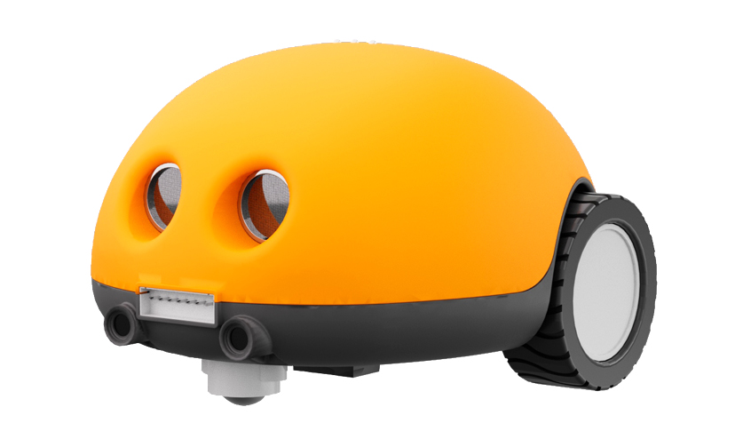
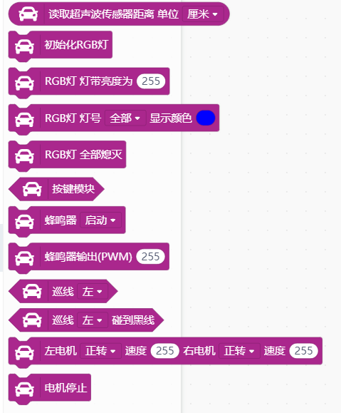
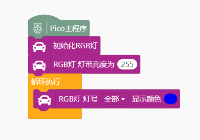

# 人工智能小车(Ⅰ)




---------------------------------------------------------

## Table of Contents

* [URL](#url)
* [Summary](#summary)
* [Blocks](#blocks)
* [License](#license)
* [Supported targets](#Supportedtargets)

## URL
* Project URL : ```https://github.com/DFRobot/ext-oled12864```

## Summary
育伟达人工智能小车专用扩展库

## Blocks




## Examples



## License

MIT

## Supported targets

MCU                | JavaScript    | Arduino   | MicroPython    | Remarks
------------------ | :----------: | :----------: | :---------: | -----
pico        |             |       √       |             | 
